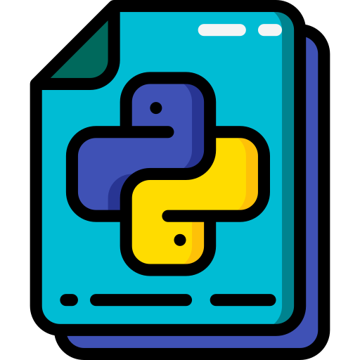

<br>
<a href='#'>
<p align="center">
   
</p>
</a>

<h1 align='center'>Python Notes</h1>

<h6 align='center'>This is my notes that I made while learning to code in <ul><b>Python</b></ul></h6>
<br>

- Python is a high-level, interpreted, interactive and object-oriented scripting language. Python is designed to be highly readable. It uses English keywords frequently where as other languages use punctuation, and it has fewer syntactical constructions than other languages.

- Python can be used for:
  - Web Development (Server-Side)
  - Software Development
  - Mathematics
  - System Scripting

### 🔴 1. Variables

- Variables are containers for storing data values.
- Unlike other programming languages, Python has no command for declaring a variable.
  eg:

```python
x = 5
y = "Hello, World!"
print(x)
print(y)
```

Output:

```python
5
Hello, World!
```

- Variable Names:
  - A variable name must start with a letter or the underscore character.
  - A variable name cannot start with a number.
  - A variable name can only contain alpha-numeric characters and underscores (A-z, 0-9, and \_ ).
  - Variable names are case-sensitive (age, Age and AGE are three different variables).
  - The variable name must not contain any special characters like !, @, #, $, % etc.
  - A variable name cannot be any of the Python keywords

### 🔴 2. Comments

- Comments can be used to explain Python code.
- Comments can be used to make the code more readable.
  eg:

```python
# This is a comment
print("Hello, World!")
```

Output:

```python
Hello, World!
```

- Multi Line Comments

```python
""" This is a comment
written in
more than just one line """
print("Hello, World!")
```

Output:

```python
Hello, World!
```

### 🔴 3. Concatanation

- To combine both text and a variable, Python uses the + character:
  eg:

```python
x = "awesome"
print("Python is " + x)
```

Output:

```python
Python is awesome
```

- You can also use the + character to add a variable to another variable:
  eg:

```python
x = "Python is "
y = "awesome"
z = x + y
print(z)
```

Output:

```python
Python is awesome
```

### 🔴 Data Types

- In programming, data type is an important concept.
- Variables can store data of different types, and different types can do different things.
- Python has the following data types built-in by default, in these categories:

  - Text Type: `str`
  - Numeric Types: `int`, `float`, `complex`
  - Sequence Types: `list`, `tuple`, `range`
  - Mapping Type: `dict`
  - Set Types: `set`, `frozenset`
  - Boolean Type: `bool`
  - Binary Types: `bytes`, `bytearray`, `memoryview`
  - None Type: `NoneType`

- Setting data types:

```python
x = "Hello World" # str
x = 20 # int
x = 20.5 # float
x = 1j # complex
x = ["apple", "banana", "cherry"] # list
x = ("apple", "banana", "cherry") # tuple
x = range(6) # range
x = {"name" : "John", "age" : 36} # dict
x = {"apple", "banana", "cherry"} # set
x = frozenset({"apple", "banana", "cherry"}) # frozenset
x = True # bool
x = b"Hello" # bytes
x = bytearray(5) # bytearray
x = memoryview(bytes(5)) # memoryview
x = None # NoneType
```

- Setting the Specific Data Type:

```python
x = str("Hello World") # str
x = int(20) # int
x = float(20.5) # float
x = complex(1j) # complex
x = list(("apple", "banana", "cherry")) # list
x = tuple(("apple", "banana", "cherry")) # tuple
x = range(6) # range
x = dict(name="John", age=36) # dict
x = set(("apple", "banana", "cherry")) # set
x = frozenset(("apple", "banana", "cherry")) # frozenset
x = bool(5) # bool
x = bytes(5) # bytes
x = bytearray(5) # bytearray
x = memoryview(bytes(5)) # memoryview
```

### 🔴 4. Numbers

- There are three numeric types in Python:

  - int
    - Int, or integer, is a whole number, positive or negative, without decimals, of unlimited length.
  - float
    - Float, or "floating point number" is a number, positive or negative, containing one or more decimals.
  - complex
    - Complex numbers are written with a "j" as the imaginary part.

- Variables of numeric types are created when you assign a value to them:
  eg:
  ```python
  x = 1 # int
  y = 2.8 # float
  z = 1j # complex
  ```
- Note: You cannot convert complext numbers into another number type.

- Random Number:

```python
import random
print(random.randrange(1, 10))
```

Output:

```python
4
```

### 🔴 5. Casting

- There may be times when you want to specify a type on to a variable. This can be done with casting.
- Casting in python is therefore done using constructor functions:

  - `int()`
  - `float()`
  - `str()`

- Integers:

  ```python
  x = int(1) # x will be 1
  y = int(2.8) # y will be 2
  z = int("3") # z will be 3
  ```

- Floats:

  ```python
  x = float(1) # x will be 1.0
  y = float(2.8) # y will be 2.8
  z = float("3") # z will be 3.0
  w = float("4.2") # w will be 4.2
  ```

- Strings:

  ```python
  x = str("s1") # x will be 's1'
  y = str(2) # y will be '2'
  z = str(3.0) # z will be '3.0'
  ```

### 🔴 6. Strings

- Strings in python are surrounded by either single quotation marks, or double quotation marks.
- `str` is the data type for strings in python.
- You can display a string literal with the `print()` function:

```python
print("Hello")
print('Hello')
```

Output:

```python
Hello
Hello
```

- Assigning a string to a variable:

```python
a = "Hello"
print(a)
```

Output:

```python
Hello
```

- Multiline Strings:

```python
a = """This is a multiline string,
come back, I still miss you,
but whocares,
hahaha"""
print(a)
```

Output:

```python
This is a multiline string,
come back, I still miss you,
but whocares,
hahaha
```

- Strings are Arrays:

```python
a = "Hello, World!"
print(a[1])
```

Output:

```python
e
```

- Slicing:

```python
b = "Hello, World!"
print(b[2:5])
```

Output:

```python
llo
```

- Negative Indexing:

```python
b = "Hello, World!"
print(b[-5:-2])
```

Output:

```python
orl
```

- String Length:

```python
a = "Hello, World!"
print(len(a))
```

Output:

```python
13
```

- String Methods:

  - `strip()` - Removes any whitespace from the beginning or the end
  - `lower()` - Returns the string in lower case
  - `upper()` - Returns the string in upper case
  - `replace()` - Replaces a string with another string
  - `split()` - Splits the string into substrings if it finds instances of the separator
  - `capitalize()` - Converts the first character to upper case
  - `casefold()` - Converts string into lower case
  - `center()` - Returns a centered string
  - `count()` - Returns the number of times a specified value occurs in a string
  - `encode()` - Returns an encoded version of the string
  - `endswith()` - Returns true if the string ends with the specified value
  - `expandtabs()` - Sets the tab size of the string
  - `find()` - Searches the string for a specified value and returns the position of where it was found
  - `format()` - Formats specified values in a string
  - `index()` - Searches the string for a specified value and returns the position of where it was found
  - `isalnum()` - Returns True if all characters in the string are alphanumeric
  - `isalpha()` - Returns True if all characters in the string are in the alphabet
  - `isdecimal()` - Returns True if all characters in the string are decimals
  - `isdigit()` - Returns True if all characters in the string are digits
  - `isidentifier()` - Returns True if the string is an identifier
  - `islower()` - Returns True if all characters in the string are lower case
  - `isnumeric()` - Returns True if all characters in the string are numeric
  - `isprintable()` - Returns True if all characters in the string are printable
  - `isspace()` - Returns True if all characters in the string are whitespaces
  - `istitle()` - Returns True if the string follows the rules of a title
  - `isupper()` - Returns True if all characters in the string are upper case
  - `join()` - Joins the elements of an iterable to the end of the string
  - `ljust()` - Returns a left justified version of the string
  - `lstrip()` - Returns a left trim version of the string
  - `maketrans()` - Returns a translation table to be used in translations
  - `partition()` - Returns a tuple where the string is parted into three parts
  - `rfind()` - Searches the string for a specified value and returns the last position of where it was found
  - `rindex()` - Searches the string for a specified value and returns the last position of where it was found
  - `rjust()` - Returns a right justified version of the string
  - `rpartition()` - Returns a tuple where the string is parted into three parts
  - `rsplit()` - Splits the string at the specified separator, and returns a list
  - `rstrip()` - Returns a right trim version of the string
  - `splitlines()` - Splits the string at line breaks and returns a list
  - `startswith()` - Returns true if the string starts with the specified value
  - `swapcase()` - Swaps cases, lower case becomes upper case and vice versa
  - `title()` - Converts the first character of each word to upper case
  - `translate()` - Returns a translated string
  - `zfill()` - Fills the string with a specified number of 0 values at the beginning

- Check String:

  - `isalnum()` - Returns True if all characters in the string are alphanumeric
  - `isalpha()` - Returns True if all characters in the string are in the alphabet
  - `isdecimal()` - Returns True if all characters in the string are decimals
  - `isdigit()` - Returns True if all characters in the string are digits
  - `isidentifier()` - Returns True if the string is an identifier
  - `islower()` - Returns True if all characters in the string are lower case
  - `isnumeric()` - Returns True if all characters in the string are numeric
  - `isprintable()` - Returns True if all characters in the string are printable
  - `isspace()` - Returns True if all characters in the string are whitespaces
  - `istitle()` - Returns True if the string follows the rules of a title
  - `isupper()` - Returns True if all characters in the string are upper case

- String Format:

  - `format()` - Formats specified values in a string
  - `capitalize()` - Converts the first character to upper case
  - `casefold()` - Converts string into lower case
  - `center()` - Returns a centered string
  - `count()` - Returns the number of times a specified value occurs in a string
  - `encode()` - Returns an encoded version of the string
  - `endswith()` - Returns true if the string ends with the specified value
  - `expandtabs()` - Sets the tab size of the string
  - `find()` - Searches the string for a specified value and returns the position of where it was found
  - `index()` - Searches the string for a specified value and returns the position of where it was found
  - `join()` - Joins the elements of an iterable to the end of the string
  - `ljust()` - Returns a left justified version of the string
  - `lower()` - Converts a string into lower case
  - `lstrip()` - Returns a left trim version of the string
  - `maketrans()` - Returns a translation table to be used in translations
  - `partition()` - Returns a tuple where the string is parted into three parts
  - `replace()` - Returns a string where a specified value is replaced with a specified value
  - `rfind()` - Searches the string for a specified value and returns the last position of where it was found
  - `rindex()` - Searches the string for a specified value and returns the last position of where it was found
  - `rjust()` - Returns a right justified version of the string
  - `rpartition()` - Returns a tuple where the string is parted into three parts
  - `rsplit()` - Splits the string at the specified separator, and returns a list
  - `rstrip()` - Returns a right trim version of the string
  - `split()` - Splits the string at the specified separator, and returns a list
  - `splitlines()` - Splits the string at line breaks and returns a list
  - `startswith()` - Returns true if the string starts with the specified value
  - `strip()` - Returns a trimmed version of the string
  - `swapcase()` - Swaps cases, lower case becomes upper case and vice versa
  - `title()` - Converts the first character of each word to upper case

- Check if a certain phrase or character is present in a string

  ```python
  txt = "God is watching."
  x = "NOT" in txt
  print(x)
  ```

  Output:

  ```python
  False
  ```

- Check if a certain phrase or character is NOT present in a string

  ```python
  txt = "Saturn is my favourite planet."
  x = "Earth" not in txt
  print(x)
  ```

  Output:

  ```python
  True
  ```

- String Concatenation:

  ```python
  a = "Hello"
  b = "World"
  c = a + b
  print(c)
  ```

  Output:

  ```python
  HelloWorld
  ```

- String Format:

  ```python
  age = 36
  txt = "My name is John, and I am {}"
  print(txt.format(age))
  ```

  Output:

  ```python
  My name is John, and I am 36
  ```

- Escape Character:

  - To insert characters that are illegal in a string, use an escape character.
  - An escape character is a backslash `\` followed by the character you want to insert.
  - An example of an illegal character is a double quote inside a string that is surrounded by double quotes:

  ```python
  txt = "We are the so-called \"Vikings\" from the north."
  print(txt)
  ```

  Output:

  ```python
  We are the so-called "Vikings" from the north.
  ```

### 🔴 7. Booleans

- Booleans represent one of two values: `True` or `False`.
- In programming you often need to know if an expression is `True` or `False`.

### 🔴 8. Python Operators

- Operators are used to perform operations on variables and values.
- Python divides the operators in the following groups:

  - Arithmetic operators
  - Assignment operators
  - Comparison operators
  - Logical operators
  - Identity operators
  - Membership operators
  - Bitwise operators

- Arithmetic Operators:

  - `+` - Addition
  - `-` - Subtraction
  - `*` - Multiplication
  - `/` - Division
  - `%` - Modulus
  - `**` - Exponentiation
  - `//` - Floor division

- Assignment Operators:

  - `=` - x = 5
  - `+=` - x += 3
  - `-=` - x -= 3
  - `*=` - x \*= 3
  - `/=` - x /= 3
  - `%=` - x %= 3
  - `//=` - x //= 3
  - `**=` - x \*\*= 3
  - `&=` - x &= 3
  - `|=` - x |= 3
  - `^=` - x ^= 3
  - `>>=` - x >>= 3
  - `<<=` - x <<= 3

- Comparison Operators:

  - `==` - Equal
  - `!=` - Not equal
  - `>` - Greater than
  - `<` - Less than
  - `>=` - Greater than or equal to
  - `<=` - Less than or equal to

- Logical Operators:

  - `and` - Returns True if both statements are true
  - `or` - Returns True if one of the statements is true
  - `not` - Reverse the result, returns False if the result is true

- Identity Operators:

  - `is` - Returns True if both variables are the same object
  - `is not` - Returns True if both variables are not the same object

- Membership Operators:

  - `in` - Returns True if a sequence with the specified value is present in the object
  - `not in` - Returns True if a sequence with the specified value is not present in the object

- Bitwise Operators:
  - `&` - AND
  - `|` - OR
  - `^` - XOR
  - `~` - NOT
  - `<<` - Zero fill left shift
  - `>>` - Signed right shift

### 🔴 9. Lists

- Lists are used to store multiple items in a single variable.
- Lists are created using square brackets:

```python
thislist = ["apple", "banana", "cherry"]
print(thislist)
```

Output:

```python
['apple', 'banana', 'cherry']
```

- List Items:

  - List items are ordered, changeable, and allow duplicate values.
  - List items are indexed, the first item has index [0], the second item has index [1] etc.

- List Items - Data Types:

  - List items can be of any data type:

  ```python
  list1 = ["apple", "banana", "cherry"]
  list2 = [1, 5, 7, 9, 3]
  list3 = [True, False, False]
  ```

- A list can contain different data types:

  ```python
  list1 = ["apple", "banana", "cherry"]
  list2 = [1, 5, 7, 9, 3]
  list3 = [True, False, False]
  list4 = ["apple", 5, True, "banana", "cherry"]
  ```

- type():

  - From Python's perspective, lists are defined as objects with the data type 'list':

  ```python
  mylist = ["apple", "banana", "cherry"]
  print(type(mylist))
  ```

  Output:

  ```python
  <class 'list'>
  ```

### 🔴 10. Tuples

- Tuples are used to store multiple items in a single variable.
- A tuple is a collection which is ordered and unchangeable.
- Tuples are written with round brackets.

```python
thistuple = ("apple", "banana", "cherry")
print(thistuple)
```

Output:

```python
('apple', 'banana', 'cherry')
```

- Tuple Items:

  - Tuple items are ordered, unchangeable, and allow duplicate values.
  - Tuple items are indexed, the first item has index [0], the second item has index [1] etc.

- Tuple Items - Data Types:

  - Tuple items can be of any data type:

  ```python
  tuple1 = ("apple", "banana", "cherry")
  tuple2 = (1, 5, 7, 9, 3)
  tuple3 = (True, False, False)
  ```

- A tuple can contain different data types:

  ```python
  tuple1 = ("apple", "banana", "cherry")
  tuple2 = (1, 5, 7, 9, 3)
  tuple3 = (True, False, False)
  tuple4 = ("apple", 5, True, "banana", "cherry")
  ```

- type(): - From Python's perspective, tuples are defined as objects with the data type 'tuple':

  ```python
    mytuple = ("apple", "banana", "cherry")
    print(type(mytuple))
  ```

  Output:

  ```python
    <class 'tuple'>
  ```

### 🔴 11. Sets

- Sets are used to store multiple items in a single variable.
- A set is a collection which is both unordered and unindexed.
- Sets are written with curly brackets.

```python
thisset = {"apple", "banana", "cherry"}
print(thisset)
```

Output:

```python
{'apple', 'banana', 'cherry'}
```

- Set Items:

  - Set items are unordered, unchangeable, and do not allow duplicate values.
  - Set items are indexed, the first item has index [0], the second item has index [1] etc.

- Set Items - Data Types:

  - Set items can be of any data type:

  ```python
  set1 = {"apple", "banana", "cherry"}
  set2 = {1, 5, 7, 9, 3}
  set3 = {True, False, False}
  ```

- A set can contain different data types:

  ```python
  set1 = {"apple", "banana", "cherry"}
  set2 = {1, 5, 7, 9, 3}
  set3 = {True, False, False}
  set4 = {"apple", 5, True, "banana", "cherry"}
  ```

- type(): - From Python's perspective, sets are defined as objects with the data type 'set':

  ```python
    myset = {"apple", "banana", "cherry"}
    print(type(myset))
  ```

  Output:

  ```python
    <class 'set'>
  ```

### 🔴 12. Dictionaries

- Dictionaries are used to store data values in key:value pairs.
- A dictionary is a collection which is ordered\*, changeable and does not allow duplicates.
- Dictionaries are written with curly brackets, and have keys and values.

```python
thisdict = {
  "brand": "Ford",
  "model": "Mustang",
  "year": 1964
}
print(thisdict)
```

Output:

```python
{'brand': 'Ford', 'model': 'Mustang', 'year': 1964}
```

- Dictionary Items:

  - Dictionary items are ordered, changeable, and does not allow duplicates.
  - Dictionary items are indexed, the first item has index [0], the second item has index [1] etc.

- Dictionary Items - Data Types:

  - Dictionary items can be of any data type:

  ```python
  thisdict = {
    "brand": "Ford",
    "electric": False,
    "year": 1964,
    "colors": ["red", "white", "blue"]
  }
  ```

- type(): - From Python's perspective, dictionaries are defined as objects with the data type 'dict':

  ```python
    mydict = {
      "brand": "Ford",
      "model": "Mustang",
      "year": 1964
    }
    print(type(mydict))
  ```

  Output:

  ```python
    <class 'dict'>
  ```

### 🔴 13. If...Else

- Python supports the usual logical conditions from mathematics:

  - Equals: `a == b`
  - Not Equals: `a != b`
  - Less than: `a < b`
  - Less than or equal to: `a <= b`
  - Greater than: `a > b`
  - Greater than or equal to: `a >= b`

```python
a = 33
b = 200
if b > a:
  print("b is greater than a")
```

Output:

```python
b is greater than a
```

- Elif:

  - The `elif` keyword is pythons way of saying "if the previous conditions were not true, then try this condition".

```python
a = 33
b = 33
if b > a:
  print("b is greater than a")
elif a == b:
  print("a and b are equal")
```

Output:

```python
a and b are equal
```

- Else:

  - The `else` keyword catches anything which isn't caught by the preceding conditions.

```python
a = 200
b = 33
if b > a:
  print("b is greater than a")
elif a == b:
  print("a and b are equal")
else:
  print("a is greater than b")
```

Output:

```python
a is greater than b
```

- Short Hand If:

  - If you have only one statement to execute, you can put it on the same line as the `if` statement.

```python
if a > b: print("a is greater than b")
```

Output:

```python
a is greater than b
```

- Short Hand If...Else:

  - If you have only one statement to execute, one for if, and one for else, you can put it all on the same line.

```python
a = 2
b = 330
print("A") if a > b else print("B")
```

Output:

```python
B
```

- And:

  - The `and` keyword is a logical operator, and is used to combine conditional statements.

```python
a = 200
b = 33
c = 500
if a > b and c > a:
  print("Both conditions are True")
```

Output:

```python
Both conditions are True
```

- Or:

  - The `or` keyword is a logical operator, and is used to combine conditional statements.

```python
a = 200
b = 33
c = 500
if a > b or a > c:
  print("At least one of the conditions is True")
```

Output:

```python
At least one of the conditions is True
```

- Nested If:

  - You can have `if` statements inside `if` statements, this is called nested `if` statements.

```python
x = 41
if x > 10:
  print("Above ten,")
  if x > 20:
    print("and also above 20!")
  else:
    print("but not above 20.")
```

Output:

```python
Above ten,
and also above 20!
```

### 🔴 14. While Loops

- With the `while` loop we can execute a set of statements as long as a condition is true.

```python
i = 1
while i < 6:
  print(i)
  i += 1
```

Output:

```python
1
2
3
4
5
```

- The `break` Statement:

  - With the `break` statement we can stop the loop even if the while condition is true.

```python
i = 1
while i < 6:
  print(i)
  if i == 3:
    break
  i += 1
```

Output:

```python
1
2
3
```

- The `continue` Statement:

  - With the `continue` statement we can stop the current iteration, and continue with the next.

```python
i = 0
while i < 6:
  i += 1
  if i == 3:
    continue
  print(i)
```

Output:

```python
1
2
4
5
6
```

- The `else` Statement:

  - With the `else` statement we can run a block of code once when the condition no longer is true.

```python
i = 1
while i < 6:
  print(i)
  i += 1
else:
  print("i is no longer less than 6")
```

Output:

```python
1
2
3
4
5
i is no longer less than 6
```

### 🔴 15. For Loops

- A `for` loop is used for iterating over a sequence (that is either a list, a tuple, a dictionary, a set, or a string).

```python
fruits = ["apple", "banana", "cherry"]
for x in fruits:
  print(x)
```

Output:

```python
apple
banana
cherry
```

- Looping Through a String:

```python
for x in "banana":
  print(x)
```

Output:

```python
b
a
n
a
n
a
```

- The `break` Statement:

  - With the `break` statement we can stop the loop before it has looped through all the items.

```python
fruits = ["apple", "banana", "cherry"]
for x in fruits:
  print(x)
  if x == "banana":
    break
```

Output:

```python
apple
banana
```

- The `continue` Statement:

  - With the `continue` statement we can stop the current iteration of the loop, and continue with the next.

```python
fruits = ["apple", "banana", "cherry"]
for x in fruits:
  if x == "banana":
    continue
  print(x)
```

Output:

```python
apple
cherry
```

- The `range()` Function:

  - To loop through a set of code a specified number of times, we can use the `range()` function.

```python
for x in range(6):
  print(x)
```

Output:

```python
0
1
2
3
4
5
```

- The `range()` Function:

  - The `range()` function defaults to 0 as a starting value, however it is possible to specify the starting value by adding a parameter: `range(2, 6)`, which means values from 2 to 6 (but not including 6):

```python
for x in range(2, 6):
  print(x)
```

Output:

```python
2
3
4
5
```

- The `range()` Function:

  - The `range()` function defaults to increment the sequence by 1, however it is possible to specify the increment value by adding a third parameter: `range(2, 30, 3)`:

```python
for x in range(2, 30, 3):
  print(x)
```

Output:

```python
2
5
8
11
14
17
20
23
26
29
```

- Else in For Loop:

  - The `else` keyword in a `for` loop specifies a block of code to be executed when the loop is finished.

```python
for x in range(6):
  print(x)
else:
  print("Finally finished!")
```

Output:

```python
0
1
2
3
4
5
Finally finished!
```

- Nested Loops:

  - A nested loop is a loop inside a loop.
  - The "inner loop" will be executed one time for each iteration of the "outer loop".

```python
adj = ["red", "big", "tasty"]
fruits = ["apple", "banana", "cherry"]

for x in adj:
  for y in fruits:
    print(x, y)
```

Output:

```python
red apple
red banana
red cherry
big apple
big banana
big cherry
tasty apple
tasty banana
tasty cherry
```

### 🔴 16. Functions

- A function is a block of code which only runs when it is called.
- You can pass data, known as parameters, into a function.
- A function can return data as a result.

```python
def my_function():
  print("Hello from a function")

my_function()
```

Output:

```python
Hello from a function
```

- Arguments:

  - Information can be passed into functions as arguments.

```python
def my_function(fname):
  print(fname + " Kumar")

my_function("Rahul")
my_function("Rohit")
my_function("Raj")
```

Output:

```python
Rahul Kumar
Rohit Kumar
Raj Kumar
```

- Number of Arguments:

  - By default, a function must be called with the correct number of arguments. Meaning that if your function expects 2 arguments, you have to call the function with 2 arguments, not more, and not less.

```python
def my_function(fname, lname):
  print(fname + " " + lname)

my_function("Rahul", "Kumar")
```

Output:

```python
Rahul Kumar
```

- Arbitrary Arguments, `*args`:

  - If you do not know how many arguments that will be passed into your function, add a `*` before the parameter name in the function definition.

```python
def my_function(*kids):
  print("The youngest child is " + kids[2])

my_function("Emil", "Tobias", "Linus")
```

Output:

```python
The youngest child is Linus
```

- Keyword Arguments:

  - You can also send arguments with the key = value syntax.

```python
def my_function(child3, child2, child1):
  print("The youngest child is " + child3)

my_function(child1 = "Emil", child2 = "Tobias", child3 = "Linus")
```

Output:

```python
The youngest child is Linus
```

- Arbitrary Keyword Arguments, `**kwargs`:

  - If you do not know how many keyword arguments that will be passed into your function, add two asterisk: `**` before the parameter name in the function definition.

```python
def my_function(**kid):
  print("His last name is " + kid["lname"])

my_function(fname = "Aditya", lname = "Raj")
```

Output:

```python
His last name is Raj
```

- Default Parameter Value:

  - The following example shows how to use a default parameter value.

```python
def my_function(country = "India"):
  print("I am from " + country)

my_function("Sweden")
my_function("Norway")
my_function()
my_function("Brazil")
```

Output:

```python
I am from Sweden
I am from Norway
I am from India
I am from Brazil
```

- Passing a List as an Argument:

  - You can send any data types of argument to a function (string, number, list, dictionary etc.), and it will be treated as the same data type inside the function.

```python
def my_function(food):
  for x in food:
    print(x)

fruits = ["apple", "banana", "cherry"]
my_function(fruits)
```

Output:

```python
apple
banana
cherry
```

- Return Values:

  - To let a function return a value, use the `return` statement.

```python
def my_function(x):
  return 5 * x

print(my_function(3))
print(my_function(5))
print(my_function(9))
```

Output:

```python
15
25
45
```

- The `pass` Statement:

  - function definitions cannot be empty, but if you for some reason have a function definition with no content, put in the `pass` statement to avoid getting an error.

```python
def myfunction():
  pass
```

### 🔴 17. Lambda

- A lambda function is a small anonymous function.
- A lambda function can take any number of arguments, but can only have one expression.

```python
x = lambda a : a + 10
print(x(5))
```

Output:

```python
15
```

- Lambda functions can take any number of arguments:

```python
x = lambda a, b : a * b
print(x(5, 6))
```

Output:

```python
30
```

```python
x = lambda a, b, c : a + b + c
print(x(5, 6, 2))
```

Output:

```python
13
```

- Why Use Lambda Functions?

  - The power of lambda is better shown when you use them as an anonymous function inside another function.

```python
def myfunc(n):
  return lambda a : a * n

mydoubler = myfunc(2)
mytripler = myfunc(3)

print(mydoubler(11))
print(mytripler(11))
```

Output:

```python
22
33
```

### 🔴 18. Arrays

- Arrays are used to store multiple values in one single variable.

```python
cars = ["Ford", "Volvo", "BMW"]
```

- Access the Elements of an Array:

  - You refer to an array element by referring to the index number.

```python
x = cars[0]
```

- Modify the value of the first array item:

```python
cars[0] = "Toyota"
```

- The Length of an Array:

  - Use the `len()` method to return the length of an array (the number of elements in an array).

```python
x = len(cars)
```

- Looping Array Elements:

  - You can use the `for` in loop to loop through all the elements of an array.

```python
for x in cars:
  print(x)
```

- Adding Array Elements:

  - You can use the `append()` method to add an element to an array.

```python
cars.append("Honda")
```

- Removing Array Elements:

  - You can use the `pop()` method to remove an element from the array.

```python
cars.pop(1)
```

- Array Methods:

  - `append()` - Adds an element at the end of the list
  - `clear()` - Removes all the elements from the list
  - `copy()` - Returns a copy of the list
  - `count()` - Returns the number of elements with the specified value
  - `extend()` - Add the elements of a list (or any iterable), to the end of the current list
  - `index()` - Returns the index of the first element with the specified value
  - `insert()` - Adds an element at the specified position
  - `pop()` - Removes the element at the specified position
  - `remove()` - Removes the first item with the specified value
  - `reverse()` - Reverses the order of the list
  - `sort()` - Sorts the list

### 🔴 19. Classes/Objects

- Python is an object oriented programming language.
- Almost everything in Python is an object, with its properties and methods.

- A Class is like an object constructor, or a "blueprint" for creating objects.

```python
class MyClass:
  x = 5
```

- Create an Object:

  - Now we can use the class named `MyClass` to create objects.

```python
p1 = MyClass()
print(p1.x)
```

Output:

```python
5
```

- The `__init__()` Function:

  - The examples above are classes and objects in their simplest form, and are not really useful in real life applications.
  - To understand the meaning of classes we have to understand the built-in `__init__()` function.
  - All classes have a function called `__init__()`, which is always executed when the class is being initiated.
  - Use the `__init__()` function to assign values to object properties, or other operations that are necessary to do when the object is being created.

```python
class Person:
  def __init__(self, name, age):
    self.name = name
    self.age = age

p1 = Person("John", 36)

print(p1.name)
print(p1.age)
```

Output:

```python
John
36
```

- Object Methods:

  - Objects can also contain methods. Methods in objects are functions that belong to the object.

```python
class Person:
  def __init__(self, name, age):
    self.name = name
    self.age = age

  def myfunc(self):
    print("Hello my name is " + self.name)

p1 = Person("John", 36)
p1.myfunc()
```

Output:

```python
Hello my name is John
```

- The `self` Parameter:

  - The `self` parameter is a reference to the current instance of the class, and is used to access variables that belong to the class.

```python
class Person:
  def __init__(mysillyobject, name, age):
    mysillyobject.name = name
    mysillyobject.age = age

  def myfunc(abc):
    print("Hello my name is " + abc.name)

p1 = Person("John", 36)
p1.myfunc()
```

Output:

```python
Hello my name is John
```

- Modify Object Properties:

  - You can modify properties on objects like this:

```python
p1.age = 40
```

- Delete Object Properties:

  - You can delete properties on objects by using the `del` keyword:

```python
del p1.age
```

- Delete Objects:

  - You can delete objects by using the `del` keyword:

```python
del p1
```

### 🔴 20. Inheritance

- Inheritance allows us to define a class that inherits all the methods and properties from another class.

- Parent Class:

  - The class being inherited from is called the parent class.

```python
class Person:
  def __init__(self, fname, lname):
    self.firstname = fname
    self.lastname = lname

  def printname(self):
    print(self.firstname, self.lastname)

x = Person("John", "Doe")
x.printname()
```

Output:

```python
John Doe
```

- Child Class:

  - The class that inherits from another class is called the child class.

```python
class Student(Person):
  pass
```

- Use the `super()` Function:

  - The `super()` function is used to give access to methods and properties of a parent or sibling class.

```python
class Student(Person):
  def __init__(self, fname, lname):
    super().__init__(fname, lname)

x = Student("Aditya", "Raj")
x.printname()
```

Output:

```python
Aditya Raj
```

- Add Properties:

  - Add a property called `graduationyear` to the `Student` class.

```python
class Student(Person):
  def __init__(self, fname, lname, year):
    super().__init__(fname, lname)
    self.graduationyear = year

x = Student("Aditya", "Raj", 2027)
```

- Add Methods:

  - Add a method called `welcome` to the `Student` class.

```python
class Student(Person):
  def __init__(self, fname, lname, year):
    super().__init__(fname, lname)
    self.graduationyear = year

  def welcome(self):
    print("Welcome", self.firstname, self.lastname, "to the class of", self.graduationyear)

x = Student
```

### 🔴 21. User Input

- Python allows for user input.

```python
username = input("Enter username:")
print("Username is: " + username)
```

Output:

```python
Enter username: Aditya
Username is: Aditya
```
